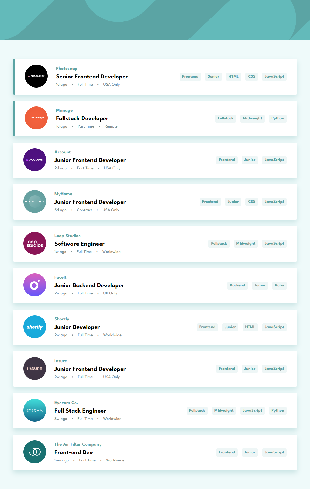
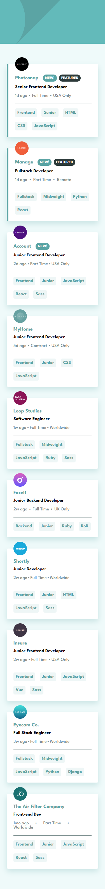

# Frontend Mentor - Job listings with filtering solution

This is a solution to the [Job listings with filtering challenge on Frontend Mentor](https://www.frontendmentor.io/challenges/job-listings-with-filtering-ivstIPCt). Frontend Mentor challenges help you improve your coding skills by building realistic projects.

## Table of contents

- [Overview](#overview)
  - [The challenge](#the-challenge)
  - [Screenshot](#screenshot)
  - [Links](#links)
- [My process](#my-process)
  - [Built with](#built-with)
  - [Useful resources](#useful-resources)
- [Author](#author)

## Overview

### The challenge

Users should be able to:

- View the optimal layout for the site depending on their device's screen size
- See hover states for all interactive elements on the page
- Filter job listings based on the categories

### Screenshot

### Links

- Solution URL: [Github]()
- Live Site URL: [Vercel]()

## My process

### Built with

- Semantic HTML5 markup
- Flexbox
- CSS Grid
- Desktop first workflow
- [Next.js](https://nextjs.org/) - React framework
- Custom useStateContext hook

### Useful resources

- [MDN](https://developer.mozilla.org/en-US/docs/Learn/Accessibility/HTML) - This helped me for Web Semantics and accessibility.

## Author

- Frontend Mentor - [@stanko-tomic](https://www.frontendmentor.io/profile/stanko-tomic)
- Github - [@stanko-tomic](https://github.com/stanko-tomic/)
